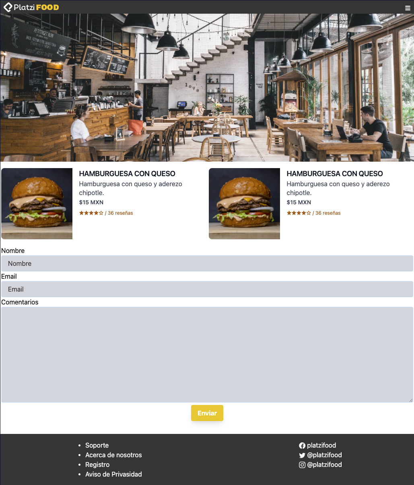

# PlatziFood



## Welcome! 👋

### Install Node

[https://nodejs.org](https://nodejs.org)

Using Ubuntu

```
curl -sL https://deb.nodesource.com/setup_15.x | sudo -E bash -

sudo apt-get install -y nodejs

```

Generate an empty npm project without going through an interactive process.

```
npm init -y

```

### Install Tailwind via npm

For most projects (and to take advantage of Tailwind's customization features), you'll want to install Tailwind and its peer-dependencies via npm.

```
npm install tailwindcss@latest postcss@latest postcss-cli autoprefixer@latest 

```

### Add Tailwind as a PostCSS plugin

Add tailwindcss and autoprefixer to your PostCSS configuration. Most of the time this is a postcss.config.js file at the root of your project, but it could also be a .postcssrc file, or postcss key in your package.json file.

```
touch postcss.config.js
```

```JavaScript
// postcss.config.js

module.exports = {
  plugins: [
    require('tailwindcss'),
    require('autoprefixer'),
  ]
}
```

### Create your configuration file

If you'd like to customize your Tailwind installation, generate a config file for your project using the Tailwind CLI utility included when you install the tailwindcss npm package:

```
npx tailwindcss init
```

This will create a minimal tailwind.config.js file at the root of your project:

```JavaScript
// tailwind.config.js
module.exports = {
  purge: [],
  darkMode: false, // or 'media' or 'class'
  theme: {
    extend: {},
  },
  variants: {},
  plugins: [],
}
```

### Include Tailwind in your CSS

Create a CSS file if you don't already have one, and use the `@tailwind` directive to inject Tailwind's `base`, `components`, and `utilities` styles:

```CSS
/* ./your-css-folder/styles.css */
@tailwind base;
@tailwind components;
@tailwind utilities;
```

If you're working in a JavaScript framework like React or Vue that supports directly importing CSS files into your JS, you can also skip creating a CSS file altogether and import `tailwindcss/tailwind.css` instead which has all of these directives already in place:

```JavaScript
// app.js
import "tailwindcss/tailwind.css"
```

### Create HTML starter template

For Tailwind's styles to work as expected, you'll want to use the HTML5 doctype and include the responsive viewport meta tag to properly handle responsive styles on all devices.

File:  public/index.html

```HTML
<!DOCTYPE html>
<html>
  <head>
    <meta charset="utf-8">
    <meta name="viewport" content="width=device-width">
    <title>Tailwind CSS</title>
    <link href="css/compiled.css" rel="stylesheet" type="text/css" />
  
  </head>
  <body>
    <h1>Hola Tailwind CSS</h1>
  </body>
</html>
```

Many front-end frameworks like Next.js, vue-cli and others do all this for you behind the scenes automatically, so depending on what you're building you might not need to set this up.

### Add build script in package.json

```JSON
{
  "scripts": {
    "test": "echo \"Error: no test specified\" && exit 1",
    "build": "postcss styles.css -o ../css/compiled.css",
    "dev": "postcss styles.css -o ../css/compiled.css --watch"
  },


```

### Run script

```
npm run build
```

```
npx tailwindcss init tailwind.config.full.js --full
```

## Alpine.js

[https://github.com/alpinejs/alpine](https://github.com/alpinejs/alpine)

### Install

From CDN: Add the following script to the end of your `<head>` section.

```html
<script src="https://cdn.jsdelivr.net/gh/alpinejs/alpine@v2.x.x/dist/alpine.min.js" defer></script>
```

That's it. It will initialize itself.

For production environments, it's recommended to pin a specific version number in the link to avoid unexpected breakage from newer versions. For example, to use version 2.8.0 (latest):

```html
<script src="https://cdn.jsdelivr.net/gh/alpinejs/alpine@v2.8.0/dist/alpine.min.js" defer></script>
```

## PurgeCSS

[https://purgecss.com](https://purgecss.com)

### Installation

```
npm i -D @fullhuman/postcss-purgecss postcss
```

In `postcss.config.js`:

```JavaScript
const purgecss = require('@fullhuman/postcss-purgecss')

module.exports = {
  plugins: [
    purgecss({
      content: [
        //'./**/*.html',
        '../*.html'
        //Para agregar soporte para otro tipo de archivos.
        // './**/*.js',
        // './**/*.vue'
      ],
      //IMPORTANTE: Para soportar pseudo-clases
      defaultExtractor: content => content.match(/[\w-/:]+(?<!:)/g) || []
    }),
  ]
```
## cssnano

[https://cssnano.co/](https://cssnano.co/)

### Installing Node.js & npm

cssnano is installed using the command line, using npm; so you will need to use an application such as Terminal or the Windows Command Prompt. If you don't already have Node.js installed, then you'll need to follow these instructions:

We require a minimum of Node.js version 6.9.0 & npm 3.10.8 to run, and we recommend that you install nvm to manage your Node.js versions.

Alternately, you can visit the Node.js website and follow the instructions there to install it for your machine.

Once you have installed Node.js & npm, you can run this command to install cssnano into your project:

```
npm install cssnano --save-dev
```

Once you have done this, you will need to configure cssnano by creating a `postcss.config.js` file in the root of your project. This should contain cssnano as well as any other plugins that you might want for your project; as an example:

```JavaScript
module.exports = {
    plugins: [
        require('cssnano')({
            preset: 'default',
        }),
    ],
};
```
